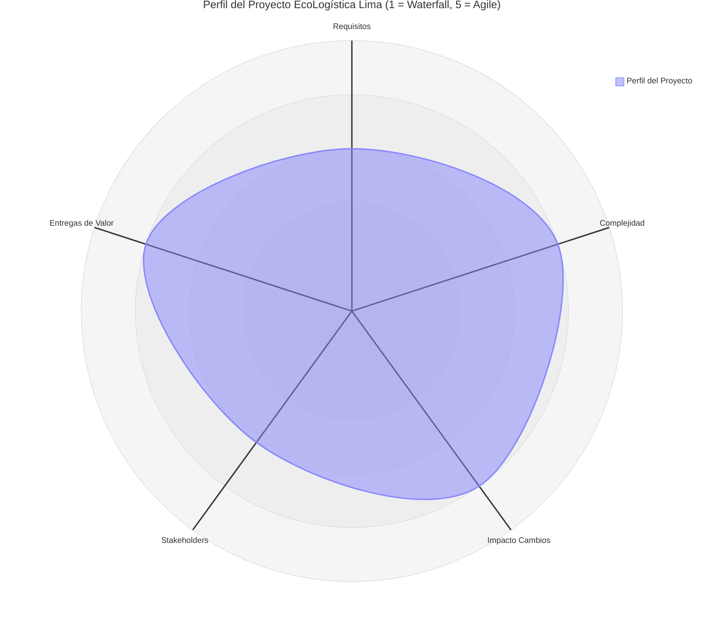

# Selección del Enfoque del Proyecto

## 1. Encabezado de Metadatos

| Campo | Detalle |
|---|---|
| **Nombre del Proyecto** | EcoLogística Lima – Optimizador de Rutas Sostenibles para DistriRápido S.A.C. |
| **Curso** | Taller de Proyectos 2 – Ingeniería de Sistemas e Informática |
| **Integrantes** | [Nombre Integrante 1] · [Nombre Integrante 2] · [Nombre Integrante 3] · [Nombre Integrante 4] |
| **Fecha** | [28/08/2026] |
| **Versión** | 1.0.0 |

---

## 2. Matriz de Ponderación de Variables

La evaluación se realiza siguiendo el marco de **Variables para la Selección del Enfoque de Desarrollo de un Proyecto**, que agrupa las variables en tres dimensiones —**Producto**, **Proyecto** y **Organización**— y las califica en una escala de **1 a 5**, donde:

- **1** = Ajuste ideal para **Waterfall** (predictivo)
- **5** = Ajuste ideal para **Agile / Adaptativo**

De acuerdo con dicho marco, el resultado se interpreta así:

| Rango de puntaje | Enfoque sugerido |
|---|---|
| 1 – 2 | Waterfall (Predictivo) |
| 2 – 4 | Híbrido |
| 4 – 5 | Agile / Adaptativo |

Cada una de las cinco variables exigidas por la consigna del curso se mapea a su(s) variable(s) equivalente(s) del documento de referencia, y se califica según la realidad del proyecto EcoLogística Lima:

| N° | Variable de Evaluación (consigna) | Variable(s) equivalente(s) del marco de referencia | Puntuación (1–5) | Justificación |
|---|---|---|---|---|
| 1 | Claridad y estabilidad de los requisitos | Certidumbre de los requisitos / Estabilidad del alcance (Producto) | 3 | Los requisitos funcionales base (registro de pedidos, cálculo de rutas, seguimiento) son claros desde el inicio, similares al ejemplo "Waterfall" de un estacionamiento de niveles definidos; sin embargo, los criterios de optimización sostenible (emisiones, restricciones de flota) evolucionan con el feedback de DistriRápido, acercándose al ejemplo "Adaptativo" de un servicio con requisitos que se ajustan en el camino. |
| 2 | Complejidad técnica e innovación | Innovación (Producto) | 4 | El proyecto no reutiliza únicamente técnicas estandarizadas: requiere algoritmos de optimización de rutas, integración de APIs de geolocalización y variables de sostenibilidad no probadas previamente por el equipo, lo que lo acerca al extremo "Adaptativo" de la variable Innovación (tecnología nueva y no probada). |
| 3 | Severidad del impacto ante cambios | Facilidad de cambio / Riesgo (Producto) | 4 | A diferencia de un entregable de alta criticidad (p. ej. un puente, donde el cambio es costoso), el software se organiza en capas/características independientes (frontend–backend), por lo que puede absorber cambios de reglas de negocio con bajo costo y sin retrasos mayores, similar al ejemplo del "tablero de desempeño electrónico" (Facilidad de cambio alta → Adaptativo). |
| 4 | Disponibilidad de los interesados (stakeholders) | Stakeholders (Proyecto) | 3 | El cliente (DistriRápido S.A.C.) y el docente participan en puntos de control periódicos (revisiones semanales/quincenales) en lugar de informes mensuales pasivos (extremo Waterfall) o disponibilidad diaria como un Product Owner (extremo Agile), ubicándose en un punto intermedio. |
| 5 | Frecuencia de entregas de valor | Opciones de entrega (Proyecto) | 4 | La consigna exige evidenciar evolución progresiva del PMV dentro de las 12 semanas mediante incrementos funcionales verificables, en línea con el ejemplo de "entregas múltiples/incrementales" del marco de referencia (actualización de un sitio web en fases), en contraste con una entrega única tipo Waterfall. |

**Puntuación promedio general:** 3.6 / 5

Según la escala de interpretación del marco de referencia, un promedio de 3.6 se ubica en el rango **Híbrido**, con una inclinación hacia el extremo **Agile/Adaptativo** (impulsada principalmente por la innovación técnica, la facilidad de cambio del software y la frecuencia de entregas), sin dejar de requerir componentes predictivos por la disponibilidad intermedia de stakeholders y la necesidad de una base de requisitos y documentación (PMBOK) definida desde el inicio.

---

## 3. Diagrama de Radar del Enfoque

### Tabla descriptiva complementaria

| Eje del radar | Puntuación | Lectura del resultado |
|---|---|---|
| Claridad y estabilidad de requisitos | 3 | Nivel intermedio: base funcional clara, con margen de ajuste iterativo en los criterios de sostenibilidad. |
| Complejidad técnica e innovación | 4 | Nivel alto (cercano a Agile): tecnología y algoritmos no completamente probados por el equipo. |
| Severidad del impacto ante cambios | 4 | Nivel alto (cercano a Agile): la arquitectura por capas/características facilita absorber cambios sin altos costos. |
| Disponibilidad de stakeholders | 3 | Nivel intermedio: retroalimentación periódica (revisiones semanales/quincenales), no continua. |
| Frecuencia de entregas de valor | 4 | Nivel alto (cercano a Agile): se exigen incrementos funcionales verificables durante las 12 semanas. |

El perfil resultante se inclina hacia el cuadrante **híbrido con fuerte componente ágil/adaptativo**, conservando suficiente estabilidad en los requisitos base y en la gestión documental (PMBOK) como para no descartar componentes predictivos.

---

## 4. Decisión y Justificación del Enfoque

### Enfoque seleccionado: **Híbrido (Predictivo-Ágil)**

El equipo determina que el enfoque más adecuado para el desarrollo del PMV de **EcoLogística Lima** es el **enfoque híbrido**, combinando elementos predictivos en la fase de inicio y planificación con ciclos ágiles/iterativos durante la ejecución y el seguimiento.

**Justificación técnica alineada al PMBOK 7ª Edición:**

1. **Dominio de desempeño de Planificación (predictivo):** Dado que el proyecto tiene un alcance macro definido por la consigna académica (12 semanas, estructura obligatoria frontend/backend, documentación basada en PMBOK), es necesario establecer de forma anticipada el alcance, la arquitectura, el cronograma y los entregables documentales (`docs/inicio`, `planificacion`, etc.), características propias de un enfoque predictivo o basado en planes.

2. **Dominio de desempeño de Enfoque de Desarrollo y Ciclo de Vida:** El PMBOK 7 reconoce que un proyecto puede adoptar un ciclo de vida híbrido cuando conviven componentes de alcance estable (requisitos base del PMV) con componentes de alta incertidumbre técnica (algoritmos de optimización de rutas sostenibles), como refleja la puntuación de 4/5 en complejidad técnica e innovación de la matriz de ponderación.

3. **Dominio de desempeño de Entrega:** La necesidad de entregas de valor frecuentes (puntuación 4/5, variable "Opciones de entrega") para validar el PMV de forma incremental con DistriRápido S.A.C. favorece sprints o iteraciones cortas dentro de las 12 semanas, en lugar de una única entrega al final del proyecto.

4. **Dominio de desempeño de Interesados:** La disponibilidad intermedia de los stakeholders (puntuación 3/5, variable "Stakeholders") sugiere puntos de control estructurados (revisiones periódicas) en vez de retroalimentación diaria típica de metodologías puramente ágiles (p. ej. Scrum estricto), lo que refuerza la conveniencia de un componente de planificación más formal combinado con iteraciones ágiles de desarrollo.

5. **Gestión de cambios y riesgo (Dominio de Incertidumbre):** La alta facilidad de cambio del software (puntuación 4/5, variable "Facilidad de cambio"), sumada al uso obligatorio de arquitectura por capas o características, permite absorber ajustes de alcance dentro de iteraciones acotadas sin necesidad de re-planificar todo el proyecto, principio central del enfoque híbrido según el PMBOK 7.

**Conclusión:** Con un promedio de 3.6/5 —dentro del rango híbrido del marco de referencia, pero con inclinación hacia el extremo ágil/adaptativo— el equipo adoptará una planificación inicial predictiva (alcance, arquitectura, cronograma, documentación PMBOK) y una ejecución ágil por iteraciones (uso de ramas, commits incrementales, entregas parciales del PMV validadas con el cliente), lo que constituye un **enfoque híbrido** consistente con la naturaleza técnica y contractual del proyecto EcoLogística Lima.

---

**Versión del documento:** 1.0.0
**Ubicación en el repositorio:** `docs/planificacion/01. Selección del enfoque del proyecto V_1_0_0.md`
