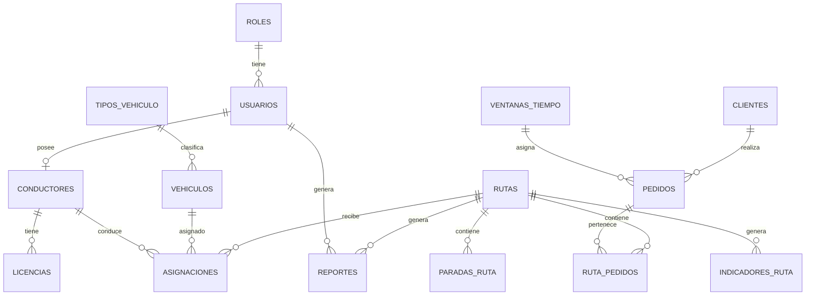

# 11. Diseño e Ingeniería de Base de Datos - EcoLogística Lima

**Proyecto:** EcoLogística Lima - Optimizador de Rutas Sostenibles para DistriRápido S.A.C.
**Versión:** V_1_0_0
**Fecha:** 04 de septiembre de 2026
**SGBD:** PostgreSQL 16 + PostGIS 3.4 + pgcrypto
**Nivel de Normalización:** 3FN (Tercera Forma Normal)
**Diagrama Fuente:** PlantUML ER - Modelo Entidad-Relación EcoLogística Lima (19 entidades)

---

## 1. Modelo Conceptual: Diagrama Entidad-Relación

Diagrama oficial del proyecto en PlantUML. Representa el dominio completo Green VRPTW para DistriRápido S.A.C. (SJL, El Agustino, Santa Anita, Ate) con 19 entidades y relaciones de seguridad, flota, pedidos y sostenibilidad.

```plantuml
@startuml
title Modelo Entidad-Relación - EcoLogística Lima
hide methods
hide stereotypes
skinparam linetype ortho

entity ROLES { * id_rol : SERIAL <<PK>> -- nombre : VARCHAR(50) }
entity USUARIOS { * id_usuario : SERIAL <<PK>> -- * id_rol : INT <<FK>> nombre : VARCHAR(100) email : VARCHAR(150) password_hash : TEXT estado : VARCHAR(20) fecha_creacion : TIMESTAMP ultimo_acceso : TIMESTAMP }
ROLES ||--o{ USUARIOS : tiene

entity CLIENTES { * id_cliente : SERIAL <<PK>> -- nombre : VARCHAR(150) documento : VARCHAR(20) telefono : VARCHAR(20) email : VARCHAR(150) direccion : TEXT referencia : TEXT latitud : DECIMAL(10,7) longitud : DECIMAL(10,7) ubicacion : GEOGRAPHY horario_apertura : TIME horario_cierre : TIME restricciones_acceso : TEXT estado : VARCHAR(20) }
entity TIPOS_VEHICULO { * id_tipo : SERIAL <<PK>> -- nombre : VARCHAR(50) descripcion : TEXT }
entity VEHICULOS { * id_vehiculo : SERIAL <<PK>> -- * id_tipo_vehiculo : INT <<FK>> placa : VARCHAR(15) marca : VARCHAR(50) modelo : VARCHAR(50) anio_fabricacion : INT capacidad_kg : DECIMAL(10,2) capacidad_m3 : DECIMAL(10,2) consumo_km_l : DECIMAL(10,2) factor_co2_kg_km : DECIMAL(10,4) tipo_combustible : VARCHAR(30) costo_adquisicion : DECIMAL(12,2) valor_actual : DECIMAL(12,2) depreciacion_anual : DECIMAL(12,2) costo_soat_anual : DECIMAL(12,2) costo_seguro_anual : DECIMAL(12,2) estado : VARCHAR(20) }
TIPOS_VEHICULO ||--o{ VEHICULOS : clasifica

entity CONDUCTORES { * id_conductor : SERIAL <<PK>> -- * id_usuario : INT <<FK>> dni : VARCHAR(15) nombre : VARCHAR(100) apellido : VARCHAR(100) telefono : VARCHAR(20) anios_experiencia : INT hora_disponibilidad_inicio : TIME hora_disponibilidad_fin : TIME horas_max_conduccion : DECIMAL(5,2) horas_conduccion_acumuladas : DECIMAL(6,2) ubicacion_inicio : GEOGRAPHY estado : VARCHAR(20) }
entity LICENCIAS { * id_licencia : SERIAL <<PK>> -- * id_conductor : INT <<FK>> numero : VARCHAR(30) categoria : VARCHAR(20) fecha_emision : DATE fecha_vencimiento : DATE estado : VARCHAR(20) }
USUARIOS ||--o| CONDUCTORES : posee
CONDUCTORES ||--o{ LICENCIAS : tiene

entity UBICACIONES { * id_ubicacion : SERIAL <<PK>> -- direccion : TEXT referencia : TEXT latitud : DECIMAL(10,7) longitud : DECIMAL(10,7) geom : GEOGRAPHY tipo : VARCHAR(30) }
entity VENTANAS_TIEMPO { * id_ventana : SERIAL <<PK>> -- hora_inicio : TIME hora_fin : TIME tolerancia_minutos : INT penalizacion_por_minuto : DECIMAL(10,2) }
entity PEDIDOS { * id_pedido : SERIAL <<PK>> -- * id_cliente : INT <<FK>> * id_ventana_tiempo : INT <<FK>> direccion_entrega : TEXT referencia : TEXT latitud : DECIMAL(10,7) longitud : DECIMAL(10,7) ubicacion : GEOGRAPHY peso_kg : DECIMAL(10,2) volumen_m3 : DECIMAL(10,2) prioridad : VARCHAR(20) tipo_producto : VARCHAR(100) estado : VARCHAR(30) fecha_registro : TIMESTAMP }
CLIENTES ||--o{ PEDIDOS : realiza
VENTANAS_TIEMPO ||--o{ PEDIDOS : asigna

entity RUTAS { * id_ruta : SERIAL <<PK>> -- fecha : DATE hora_inicio : TIMESTAMP hora_fin : TIMESTAMP distancia_km : DECIMAL(10,2) duracion_minutos : DECIMAL(10,2) distancia_base_km : DECIMAL(10,2) duracion_base_minutos : DECIMAL(10,2) combustible_litros : DECIMAL(10,2) costo_combustible : DECIMAL(12,2) costo_mantenimiento : DECIMAL(12,2) costo_conductor : DECIMAL(12,2) costo_depreciacion : DECIMAL(12,2) costo_seguro : DECIMAL(12,2) costo_total : DECIMAL(12,2) co2_kg : DECIMAL(12,2) co2_evitable_kg : DECIMAL(12,2) cumplimiento_ventanas_pct : DECIMAL(5,2) estado : VARCHAR(30) algoritmo_utilizado : VARCHAR(100) }
entity RUTA_PEDIDOS { * id_ruta : INT <<PK, FK>> * id_pedido : INT <<PK, FK>> -- orden_visita : INT hora_llegada_estimada : TIMESTAMP hora_llegada_real : TIMESTAMP tiempo_espera : INT penalizacion : DECIMAL(10,2) estado_entrega : VARCHAR(30) }
RUTAS ||--o{ RUTA_PEDIDOS : contiene
PEDIDOS ||--o{ RUTA_PEDIDOS : pertenece

entity ASIGNACIONES { * id_asignacion : SERIAL <<PK>> -- * id_ruta : INT <<FK>> * id_vehiculo : INT <<FK>> * id_conductor : INT <<FK>> fecha_asignacion : TIMESTAMP hora_salida : TIMESTAMP hora_retorno : TIMESTAMP horas_conduccion : DECIMAL(6,2) horas_descanso : DECIMAL(6,2) descanso_requerido : BOOLEAN estado : VARCHAR(20) }
RUTAS ||--o{ ASIGNACIONES : recibe
VEHICULOS ||--o{ ASIGNACIONES : asignado
CONDUCTORES ||--o{ ASIGNACIONES : conduce

entity PARADAS_RUTA { * id_parada : SERIAL <<PK>> -- * id_ruta : INT <<FK>> orden : INT latitud : DECIMAL(10,7) longitud : DECIMAL(10,7) ubicacion : GEOGRAPHY hora_llegada_estimada : TIMESTAMP hora_llegada_real : TIMESTAMP tiempo_servicio : INT tiempo_espera : INT tipo_parada : VARCHAR(30) }
RUTAS ||--o{ PARADAS_RUTA : contiene

entity TRAFICO { * id_trafico : SERIAL <<PK>> -- fecha_hora : TIMESTAMP segmento : VARCHAR(150) latitud : DECIMAL(10,7) longitud : DECIMAL(10,7) nivel_congestion : VARCHAR(20) velocidad_kmh : DECIMAL(6,2) fuente : VARCHAR(100) }
entity INCIDENTES { * id_incidente : SERIAL <<PK>> -- tipo : VARCHAR(30) descripcion : TEXT latitud : DECIMAL(10,7) longitud : DECIMAL(10,7) ubicacion : GEOGRAPHY fecha_hora : TIMESTAMP nivel : VARCHAR(20) fuente : VARCHAR(100) estado : VARCHAR(20) }
entity INDICADORES_RUTA { * id_indicador : SERIAL <<PK>> -- * id_ruta : INT <<FK>> distancia_km : DECIMAL(10,2) combustible_l : DECIMAL(10,2) co2_kg : DECIMAL(12,2) costo_total : DECIMAL(12,2) ahorro_combustible_l : DECIMAL(10,2) ahorro_economico : DECIMAL(12,2) co2_ahorrado_kg : DECIMAL(12,2) cumplimiento_ventanas_pct : DECIMAL(5,2) reduccion_co2_pct : DECIMAL(5,2) reduccion_distancia_pct : DECIMAL(5,2) fecha_calculo : TIMESTAMP }
RUTAS ||--o{ INDICADORES_RUTA : genera

entity COMPENSACION_CARBONO { * id_compensacion : SERIAL <<PK>> -- co2_total_kg : DECIMAL(12,2) co2_a_compensar_kg : DECIMAL(12,2) factor_captura_arbol_kg : DECIMAL(10,4) arboles_necesarios : DECIMAL(10,2) proyecto_reforestacion : VARCHAR(200) ubicacion : VARCHAR(200) costo_estimado : DECIMAL(12,2) fecha_calculo : TIMESTAMP }
entity REPORTES { * id_reporte : SERIAL <<PK>> -- * id_ruta : INT <<FK>> * usuario_generador : INT <<FK>> tipo : VARCHAR(50) fecha_generacion : TIMESTAMP ruta_archivo : TEXT }
RUTAS ||--o{ REPORTES : genera
USUARIOS ||--o{ REPORTES : genera
@enduml
```

**Lectura:** El modelo está en 3FN y separa responsabilidades: seguridad (ROLES/USUARIOS), maestros logísticos (CLIENTES/VEHICULOS/CONDUCTORES), operación VRPTW (VENTANAS_TIEMPO/PEDIDOS/RUTAS/RUTA_PEDIDOS/PARADAS_RUTA/ASIGNACIONES), contexto Lima (UBICACIONES/TRAFICO/INCIDENTES) y sostenibilidad (INDICADORES_RUTA/COMPENSACION_CARBONO/REPORTES).

---

## 2. Modelo Lógico: Especificación de Entidades, Atributos, PK, FK y 3FN

> Convención: `*` = NOT NULL. PK = PRIMARY KEY, FK = FOREIGN KEY. SERIAL = autoincremental PostgreSQL. GEOGRAPHY(Point/Polygon,4326) = PostGIS para Lima Metropolitana.

### 2.1 ROLES
| Atributo | Tipo | Restricción | Descripción |
| :--- | :--- | :--- | :--- |
| id_rol | SERIAL | **PK** | Identificador del rol |
| nombre | VARCHAR(50) | UNIQUE, NOT NULL, CHECK (ADMIN, OPERADOR, CONDUCTOR, AUDITOR, CLIENTE) | Nombre canónico RBAC |

### 2.2 USUARIOS
| Atributo | Tipo | Restricción | Descripción |
| :--- | :--- | :--- | :--- |
| id_usuario | SERIAL | **PK** | Usuario del sistema |
| id_rol | INT | **FK** -> ROLES(id_rol) NOT NULL, INDEX | Rol asignado |
| nombre | VARCHAR(100) | NOT NULL | Nombre completo |
| email | VARCHAR(150) | UNIQUE, NOT NULL | Login, formato email |
| password_hash | TEXT | NOT NULL | bcrypt cost 12, nunca en claro |
| estado | VARCHAR(20) | NOT NULL DEFAULT 'ACTIVO' CHECK (ACTIVO, BLOQUEADO, INACTIVO) | Para RN-001 bloqueo 3/15min |
| fecha_creacion | TIMESTAMP | NOT NULL DEFAULT CURRENT_TIMESTAMP | Auditoría |
| ultimo_acceso | TIMESTAMP | NULL | Para control de sesión |

### 2.3 CLIENTES (Bodegas/Mercados SJL, El Agustino, Santa Anita, Ate)
| Atributo | Tipo | Restricción |
| :--- | :--- | :--- |
| id_cliente | SERIAL | **PK** |
| nombre | VARCHAR(150) | NOT NULL |
| documento | VARCHAR(20) | NULL (RUC/DNI bodega) |
| telefono | VARCHAR(20) | NULL |
| email | VARCHAR(150) | NULL |
| direccion | TEXT | NOT NULL |
| referencia | TEXT | NULL - Ej. "frente a bodega El Ahorro" (RN-011) |
| latitud | DECIMAL(10,7) | NOT NULL, CHECK entre -12.4 y -11.9 |
| longitud | DECIMAL(10,7) | NOT NULL, CHECK entre -77.2 y -76.7 |
| ubicacion | GEOGRAPHY(Point,4326) | NOT NULL, GIST - generado desde lat/long |
| horario_apertura | TIME | NULL - Ej. 06:00 (bodegas) |
| horario_cierre | TIME | NULL - Ej. 21:00 |
| restricciones_acceso | TEXT | NULL - Ej. "calle no pavimentada" |
| estado | VARCHAR(20) | DEFAULT 'ACTIVO' CHECK (ACTIVO, INACTIVO) |

### 2.4 TIPOS_VEHICULO
| Atributo | Tipo | Restricción |
| :--- | :--- | :--- |
| id_tipo | SERIAL | **PK** |
| nombre | VARCHAR(50) | UNIQUE NOT NULL CHECK (CAMIONETA, FURGON, MOTO) |
| descripcion | TEXT | NULL |

### 2.5 VEHICULOS (Flota 15 camionetas diésel + futuros GNV)
| Atributo | Tipo | Restricción |
| :--- | :--- | :--- |
| id_vehiculo | SERIAL | **PK** |
| id_tipo_vehiculo | INT | **FK** -> TIPOS_VEHICULO(id_tipo) NOT NULL |
| placa | VARCHAR(15) | UNIQUE NOT NULL CHECK (placa ~ '^[A-Z0-9]{2,3}-[0-9]{3,4}$') - RN-021 |
| marca | VARCHAR(50) | NULL |
| modelo | VARCHAR(50) | NULL |
| anio_fabricacion | INT | CHECK 1990-2026 - vehículos >15 años alto factor emisión |
| capacidad_kg | DECIMAL(10,2) | NOT NULL >0 - RN-006 |
| capacidad_m3 | DECIMAL(10,2) | NOT NULL >0 |
| consumo_km_l | DECIMAL(10,2) | NOT NULL >0 - km/L |
| factor_co2_kg_km | DECIMAL(10,4) | NOT NULL >0 - RN-002 (kg CO₂/km) |
| tipo_combustible | VARCHAR(30) | CHECK (DIESEL, GNV, GASOLINA, ELECTRICO) |
| costo_adquisicion | DECIMAL(12,2) | >=0 - para TCO RN-009 |
| valor_actual | DECIMAL(12,2) | >=0 |
| depreciacion_anual | DECIMAL(12,2) | >=0 - 20% anual |
| costo_soat_anual | DECIMAL(12,2) | >=0 |
| costo_seguro_anual | DECIMAL(12,2) | >=0 |
| estado | VARCHAR(20) | DEFAULT 'ACTIVO' CHECK (ACTIVO, MANTENIMIENTO, BAJA) |

### 2.6 CONDUCTORES
| Atributo | Tipo | Restricción |
| :--- | :--- | :--- |
| id_conductor | SERIAL | **PK** |
| id_usuario | INT | **FK** -> USUARIOS(id_usuario) UNIQUE NOT NULL - relación 1:1 |
| dni | VARCHAR(15) | UNIQUE NOT NULL CHECK (dni ~ '^[0-9]{8}$') |
| nombre | VARCHAR(100) | NOT NULL |
| apellido | VARCHAR(100) | NOT NULL |
| telefono | VARCHAR(20) | NULL |
| anios_experiencia | INT | >=0 |
| hora_disponibilidad_inicio | TIME | NOT NULL |
| hora_disponibilidad_fin | TIME | NOT NULL - ventana 05:00-22:00, Ley 30224 |
| horas_max_conduccion | DECIMAL(5,2) | DEFAULT 8.0 CHECK <=8 - RN-004 |
| horas_conduccion_acumuladas | DECIMAL(6,2) | DEFAULT 0 |
| ubicacion_inicio | GEOGRAPHY(Point,4326) | NULL - RN-022 (Villa El Salvador) |
| estado | VARCHAR(20) | DEFAULT 'DISPONIBLE' CHECK (DISPONIBLE, EN_RUTA, DESCANSO, INACTIVO) |

### 2.7 LICENCIAS
| Atributo | Tipo | Restricción |
| :--- | :--- | :--- |
| id_licencia | SERIAL | **PK** |
| id_conductor | INT | **FK** -> CONDUCTORES(id_conductor) NOT NULL |
| numero | VARCHAR(30) | NOT NULL |
| categoria | VARCHAR(20) | CHECK (A-I, A-IIA, A-IIB, A-IIIA, A-IIIB, A-IIIC) |
| fecha_emision | DATE | NOT NULL |
| fecha_vencimiento | DATE | NOT NULL CHECK (fecha_vencimiento > fecha_emision) - bloquea asignación si vencida |
| estado | VARCHAR(20) | DEFAULT 'VIGENTE' CHECK (VIGENTE, VENCIDA, SUSPENDIDA) |

### 2.8 UBICACIONES (Catálogo georreferenciado Lima)
| Atributo | Tipo | Restricción |
| :--- | :--- | :--- |
| id_ubicacion | SERIAL | **PK** |
| direccion | TEXT | NOT NULL |
| referencia | TEXT | NULL |
| latitud | DECIMAL(10,7) | NOT NULL |
| longitud | DECIMAL(10,7) | NOT NULL |
| geom | GEOGRAPHY(Point,4326) | NOT NULL GIST |
| tipo | VARCHAR(30) | CHECK (PUNTO_ENTREGA, REFERENCIA, ZONA_RIESGO, RESERVA_ECOLOGICA) |

### 2.9 VENTANAS_TIEMPO (VRPTW)
| Atributo | Tipo | Restricción |
| :--- | :--- | :--- |
| id_ventana | SERIAL | **PK** |
| hora_inicio | TIME | NOT NULL |
| hora_fin | TIME | NOT NULL CHECK (hora_fin > hora_inicio) |
| tolerancia_minutos | INT | DEFAULT 0 >=0 |
| penalizacion_por_minuto | DECIMAL(10,2) | DEFAULT 0.50 - RN-005 (S/ por minuto tardanza) |

### 2.10 PEDIDOS
| Atributo | Tipo | Restricción |
| :--- | :--- | :--- |
| id_pedido | SERIAL | **PK** |
| id_cliente | INT | **FK** -> CLIENTES(id_cliente) NOT NULL |
| id_ventana_tiempo | INT | **FK** -> VENTANAS_TIEMPO(id_ventana) NOT NULL |
| direccion_entrega | TEXT | NOT NULL |
| referencia | TEXT | NULL |
| latitud | DECIMAL(10,7) | NOT NULL |
| longitud | DECIMAL(10,7) | NOT NULL |
| ubicacion | GEOGRAPHY(Point,4326) | NOT NULL GIST |
| peso_kg | DECIMAL(10,2) | NOT NULL >0 |
| volumen_m3 | DECIMAL(10,2) | NOT NULL >0 |
| prioridad | VARCHAR(20) | CHECK (EXPRESS, ESTANDAR, ECONOMICO) DEFAULT 'ESTANDAR' - RN-007 |
| tipo_producto | VARCHAR(100) | CHECK (PERECEDERO, NO_PERECEDERO, QUIMICO) - RN-008 |
| estado | VARCHAR(30) | DEFAULT 'PENDIENTE' CHECK (PENDIENTE, ASIGNADO, EN_RUTA, ENTREGADO, CANCELADO, FALLIDO) |
| fecha_registro | TIMESTAMP | DEFAULT CURRENT_TIMESTAMP |

### 2.11 RUTAS (Cabecera optimizada Green VRP)
| Atributo | Tipo | Restricción |
| :--- | :--- | :--- |
| id_ruta | SERIAL | **PK** |
| fecha | DATE | NOT NULL |
| hora_inicio | TIMESTAMP | NULL |
| hora_fin | TIMESTAMP | NULL CHECK (hora_fin > hora_inicio) |
| distancia_km | DECIMAL(10,2) | >=0 |
| duracion_minutos | DECIMAL(10,2) | >=0 |
| distancia_base_km | DECIMAL(10,2) | >=0 - ruta secuencial para comparativa ahorro |
| duracion_base_minutos | DECIMAL(10,2) | >=0 |
| combustible_litros | DECIMAL(10,2) | >=0 - (distancia/consumo) |
| costo_combustible | DECIMAL(12,2) | >=0 - litros * S/17.50 / S/12.50 GNV |
| costo_mantenimiento | DECIMAL(12,2) | >=0 - distancia * S/1.20 |
| costo_conductor | DECIMAL(12,2) | >=0 - prorrateo S/1,500/mes |
| costo_depreciacion | DECIMAL(12,2) | >=0 |
| costo_seguro | DECIMAL(12,2) | >=0 |
| costo_total | DECIMAL(12,2) | >=0 - TCO RN-009 |
| co2_kg | DECIMAL(12,2) | >=0 - RN-002 |
| co2_evitable_kg | DECIMAL(12,2) | >=0 |
| cumplimiento_ventanas_pct | DECIMAL(5,2) | 0-100 |
| estado | VARCHAR(30) | CHECK (PLANIFICADA, EN_CURSO, COMPLETADA, CANCELADA, REOPTIMIZADA) |
| algoritmo_utilizado | VARCHAR(100) | CHECK (GA, TABU, ACO, SA) |

### 2.12 RUTA_PEDIDOS (M:N con orden - PK compuesta)
| Atributo | Tipo | Restricción |
| :--- | :--- | :--- |
| id_ruta | INT | **PK, FK** -> RUTAS(id_ruta) ON DELETE CASCADE |
| id_pedido | INT | **PK, FK** -> PEDIDOS(id_pedido) ON DELETE RESTRICT, UNIQUE |
| orden_visita | INT | NOT NULL >0 |
| hora_llegada_estimada | TIMESTAMP | NULL |
| hora_llegada_real | TIMESTAMP | NULL |
| tiempo_espera | INT | DEFAULT 0 >=0 (min) |
| penalizacion | DECIMAL(10,2) | DEFAULT 0 - RN-005 |
| estado_entrega | VARCHAR(30) | CHECK (PENDIENTE, ENTREGADO, FALLIDO, REPROGRAMADO) |

### 2.13 ASIGNACIONES (Vehículo + Conductor -> Ruta)
| Atributo | Tipo | Restricción |
| :--- | :--- | :--- |
| id_asignacion | SERIAL | **PK** |
| id_ruta | INT | **FK** -> RUTAS(id_ruta) NOT NULL UNIQUE (1 ruta = 1 asignación) |
| id_vehiculo | INT | **FK** -> VEHICULOS(id_vehiculo) NOT NULL |
| id_conductor | INT | **FK** -> CONDUCTORES(id_conductor) NOT NULL |
| fecha_asignacion | TIMESTAMP | DEFAULT CURRENT_TIMESTAMP |
| hora_salida | TIMESTAMP | NULL |
| hora_retorno | TIMESTAMP | NULL |
| horas_conduccion | DECIMAL(6,2) | >=0 - para RN-004 |
| horas_descanso | DECIMAL(6,2) | >=0 |
| descanso_requerido | BOOLEAN | DEFAULT false - 1h cada 4h |
| estado | VARCHAR(20) | CHECK (ASIGNADA, EN_CURSO, COMPLETADA, CANCELADA) |

### 2.14 PARADAS_RUTA (Detalle geométrico para mapa Leaflet)
| Atributo | Tipo | Restricción |
| :--- | :--- | :--- |
| id_parada | SERIAL | **PK** |
| id_ruta | INT | **FK** -> RUTAS(id_ruta) NOT NULL |
| orden | INT | NOT NULL >0 |
| latitud | DECIMAL(10,7) | NOT NULL |
| longitud | DECIMAL(10,7) | NOT NULL |
| ubicacion | GEOGRAPHY(Point,4326) | NOT NULL GIST |
| hora_llegada_estimada | TIMESTAMP | NULL |
| hora_llegada_real | TIMESTAMP | NULL |
| tiempo_servicio | INT | >=0 (min en punto) |
| tiempo_espera | INT | >=0 |
| tipo_parada | VARCHAR(30) | CHECK (ENTREGA, DESCANSO, REPOSTAJE, INICIO, FIN) |

### 2.15 TRAFICO (Tiempo real Waze CCP / SIMAT)
| Atributo | Tipo | Restricción |
| :--- | :--- | :--- |
| id_trafico | SERIAL | **PK** |
| fecha_hora | TIMESTAMP | NOT NULL DEFAULT CURRENT_TIMESTAMP |
| segmento | VARCHAR(150) | NOT NULL - Ej. "Av. Próceres - cuadra 20" |
| latitud | DECIMAL(10,7) | NOT NULL |
| longitud | DECIMAL(10,7) | NOT NULL |
| nivel_congestion | VARCHAR(20) | CHECK (VERDE, AMARILLO, ROJO) |
| velocidad_kmh | DECIMAL(6,2) | >=0 |
| fuente | VARCHAR(100) | CHECK (WAZE, SIMAT, MANUAL) |

### 2.16 INCIDENTES (Accidentes, averías, robos PNP)
| Atributo | Tipo | Restricción |
| :--- | :--- | :--- |
| id_incidente | SERIAL | **PK** |
| tipo | VARCHAR(30) | CHECK (ACCIDENTE, AVERIA, ROBO, BLOQUEO, CLIMA) |
| descripcion | TEXT | NOT NULL |
| latitud | DECIMAL(10,7) | NOT NULL |
| longitud | DECIMAL(10,7) | NOT NULL |
| ubicacion | GEOGRAPHY(Point,4326) | NOT NULL GIST |
| fecha_hora | TIMESTAMP | DEFAULT CURRENT_TIMESTAMP |
| nivel | VARCHAR(20) | CHECK (ALTO, MEDIO, BAJO) |
| fuente | VARCHAR(100) | (PNP, CONDUCTOR, SIMAT) |
| estado | VARCHAR(20) | CHECK (ACTIVO, RESUELTO, CANCELADO) |

### 2.17 INDICADORES_RUTA (Dashboard sostenibilidad)
| Atributo | Tipo | Restricción |
| :--- | :--- | :--- |
| id_indicador | SERIAL | **PK** |
| id_ruta | INT | **FK** -> RUTAS(id_ruta) NOT NULL UNIQUE |
| distancia_km | DECIMAL(10,2) | >=0 |
| combustible_l | DECIMAL(10,2) | >=0 |
| co2_kg | DECIMAL(12,2) | >=0 |
| costo_total | DECIMAL(12,2) | >=0 |
| ahorro_combustible_l | DECIMAL(10,2) | Puede ser negativo si no hay ahorro |
| ahorro_economico | DECIMAL(12,2) | S/ |
| co2_ahorrado_kg | DECIMAL(12,2) | kg |
| cumplimiento_ventanas_pct | DECIMAL(5,2) | 0-100 |
| reduccion_co2_pct | DECIMAL(5,2) | % vs. base |
| reduccion_distancia_pct | DECIMAL(5,2) | % vs. base |
| fecha_calculo | TIMESTAMP | DEFAULT CURRENT_TIMESTAMP |

### 2.18 COMPENSACION_CARBONO (Plan Huáscar / Lomas de Lima)
| Atributo | Tipo | Restricción |
| :--- | :--- | :--- |
| id_compensacion | SERIAL | **PK** |
| co2_total_kg | DECIMAL(12,2) | >=0 |
| co2_a_compensar_kg | DECIMAL(12,2) | >=0 |
| factor_captura_arbol_kg | DECIMAL(10,4) | DEFAULT 22.0 - RN-018 |
| arboles_necesarios | DECIMAL(10,2) | GENERATED AS (co2_a_compensar_kg / factor_captura_arbol_kg) |
| proyecto_reforestacion | VARCHAR(200) | Ej. "Árboles para Lima - Huáscar", "Lomas de Lachay" |
| ubicacion | VARCHAR(200) | Lima Metropolitana |
| costo_estimado | DECIMAL(12,2) | >=0 |
| fecha_calculo | TIMESTAMP | DEFAULT CURRENT_TIMESTAMP |

### 2.19 REPORTES (PDF descargable)
| Atributo | Tipo | Restricción |
| :--- | :--- | :--- |
| id_reporte | SERIAL | **PK** |
| id_ruta | INT | **FK** -> RUTAS(id_ruta) NULL (reporte agregado puede no ligar a una ruta) |
| usuario_generador | INT | **FK** -> USUARIOS(id_usuario) NOT NULL |
| tipo | VARCHAR(50) | CHECK (SOSTENIBILIDAD, TCO, COMPENSACION, AUDITORIA) |
| fecha_generacion | TIMESTAMP | DEFAULT CURRENT_TIMESTAMP |
| ruta_archivo | TEXT | S3 path - Ej. "s3://ecolima/reportes/2026-09.pdf" |

**Normalización 3FN:** Todas las entidades cumplen 1FN (atributos atómicos), 2FN (sin dependencias parciales; ej. RUTA_PEDIDOS tiene PK compuesta y todos los no clave dependen de la PK completa) y 3FN (sin dependencias transitivas; ej. `factor_co2` está en VEHICULOS no en TIPOS_VEHICULO para evitar transitividad; `costo_total` en RUTAS es derivado pero se persiste para auditoría de reportes históricos con regla RN-024 de inmutabilidad). Se evita redundancia de lat/long + GEOGRAPHY mediante trigger de sincronización.

---

## 3. Modelo Físico (DDL SQL / NoSQL) e Índices

> Cumple la estructura exigida: `CREATE TABLE ...` + `CREATE INDEX ...`. Usa `SERIAL` como en el PlantUML (compatible con `INTEGER GENERATED ALWAYS AS IDENTITY`). Para producción con concurrencia alta se puede migrar a `UUID` o `BIGSERIAL`. Incluye `GEOGRAPHY` para PostGIS y `pgcrypto` para auditoría.

```sql
-- =========================================================
-- EcoLogística Lima - DDL Físico PostgreSQL 16 + PostGIS
-- Basado en PlantUML ER (19 entidades) - 3FN
-- =========================================================
CREATE EXTENSION IF NOT EXISTS "pgcrypto";
CREATE EXTENSION IF NOT EXISTS postgis;

-- Ejemplo exigido en la consigna (compatibilidad):
-- CREATE TABLE usuarios (
--     usuario_id UUID PRIMARY KEY DEFAULT gen_random_uuid(),
--     email VARCHAR(255) NOT NULL UNIQUE,
--     password_hash VARCHAR(255) NOT NULL,
--     estado VARCHAR(20) NOT NULL DEFAULT 'ACTIVO',
--     creado_en TIMESTAMP WITH TIME ZONE DEFAULT CURRENT_TIMESTAMP
-- );
-- CREATE INDEX idx_usuarios_email ON usuarios(email);
-- Nota: El modelo PlantUML usa SERIAL (INT). Se implementa SERIAL para fidelidad al diagrama.
-- Para escalabilidad horizontal se recomienda UUID gen_random_uuid().

-- =========================
-- 01. ROLES
-- =========================
CREATE TABLE roles (
    id_rol SERIAL PRIMARY KEY,
    nombre VARCHAR(50) NOT NULL UNIQUE CHECK (nombre IN ('ADMIN','OPERADOR','CONDUCTOR','AUDITOR','CLIENTE'))
);
CREATE INDEX idx_roles_nombre ON roles(nombre);

-- =========================
-- 02. USUARIOS
-- =========================
CREATE TABLE usuarios (
    id_usuario SERIAL PRIMARY KEY,
    id_rol INT NOT NULL REFERENCES roles(id_rol) ON DELETE RESTRICT,
    nombre VARCHAR(100) NOT NULL,
    email VARCHAR(150) NOT NULL UNIQUE,
    password_hash TEXT NOT NULL,
    estado VARCHAR(20) NOT NULL DEFAULT 'ACTIVO' CHECK (estado IN ('ACTIVO','BLOQUEADO','INACTIVO')),
    fecha_creacion TIMESTAMP NOT NULL DEFAULT CURRENT_TIMESTAMP,
    ultimo_acceso TIMESTAMP
);
CREATE INDEX idx_usuarios_email ON usuarios(email);
CREATE INDEX idx_usuarios_id_rol ON usuarios(id_rol);
CREATE INDEX idx_usuarios_estado ON usuarios(estado);

-- =========================
-- 03. CLIENTES
-- =========================
CREATE TABLE clientes (
    id_cliente SERIAL PRIMARY KEY,
    nombre VARCHAR(150) NOT NULL,
    documento VARCHAR(20),
    telefono VARCHAR(20),
    email VARCHAR(150),
    direccion TEXT NOT NULL,
    referencia TEXT,
    latitud DECIMAL(10,7) NOT NULL CHECK (latitud BETWEEN -13 AND -11),
    longitud DECIMAL(10,7) NOT NULL CHECK (longitud BETWEEN -78 AND -76),
    ubicacion GEOGRAPHY(Point,4326) NOT NULL,
    horario_apertura TIME,
    horario_cierre TIME,
    restricciones_acceso TEXT,
    estado VARCHAR(20) NOT NULL DEFAULT 'ACTIVO' CHECK (estado IN ('ACTIVO','INACTIVO'))
);
CREATE INDEX idx_clientes_ubicacion ON clientes USING GIST (ubicacion);
CREATE INDEX idx_clientes_estado ON clientes(estado);
CREATE INDEX idx_clientes_nombre ON clientes(nombre);

-- =========================
-- 04. TIPOS_VEHICULO
-- =========================
CREATE TABLE tipos_vehiculo (
    id_tipo SERIAL PRIMARY KEY,
    nombre VARCHAR(50) NOT NULL UNIQUE,
    descripcion TEXT
);

-- =========================
-- 05. VEHICULOS
-- =========================
CREATE TABLE vehiculos (
    id_vehiculo SERIAL PRIMARY KEY,
    id_tipo_vehiculo INT NOT NULL REFERENCES tipos_vehiculo(id_tipo) ON DELETE RESTRICT,
    placa VARCHAR(15) NOT NULL UNIQUE CHECK (placa ~ '^[A-Z0-9]{2,3}-[0-9]{3,4}$'),
    marca VARCHAR(50),
    modelo VARCHAR(50),
    anio_fabricacion INT CHECK (anio_fabricacion BETWEEN 1990 AND 2026),
    capacidad_kg DECIMAL(10,2) NOT NULL CHECK (capacidad_kg > 0),
    capacidad_m3 DECIMAL(10,2) NOT NULL CHECK (capacidad_m3 > 0),
    consumo_km_l DECIMAL(10,2) NOT NULL CHECK (consumo_km_l > 0),
    factor_co2_kg_km DECIMAL(10,4) NOT NULL CHECK (factor_co2_kg_km > 0),
    tipo_combustible VARCHAR(30) NOT NULL CHECK (tipo_combustible IN ('DIESEL','GNV','GASOLINA','ELECTRICO')),
    costo_adquisicion DECIMAL(12,2) CHECK (costo_adquisicion >= 0),
    valor_actual DECIMAL(12,2) CHECK (valor_actual >= 0),
    depreciacion_anual DECIMAL(12,2) CHECK (depreciacion_anual >= 0),
    costo_soat_anual DECIMAL(12,2) CHECK (costo_soat_anual >= 0),
    costo_seguro_anual DECIMAL(12,2) CHECK (costo_seguro_anual >= 0),
    estado VARCHAR(20) NOT NULL DEFAULT 'ACTIVO' CHECK (estado IN ('ACTIVO','MANTENIMIENTO','BAJA'))
);
CREATE INDEX idx_vehiculos_placa ON vehiculos(placa);
CREATE INDEX idx_vehiculos_tipo ON vehiculos(id_tipo_vehiculo);
CREATE INDEX idx_vehiculos_estado ON vehiculos(estado);
CREATE INDEX idx_vehiculos_combustible ON vehiculos(tipo_combustible);

-- =========================
-- 06. CONDUCTORES
-- =========================
CREATE TABLE conductores (
    id_conductor SERIAL PRIMARY KEY,
    id_usuario INT NOT NULL UNIQUE REFERENCES usuarios(id_usuario) ON DELETE RESTRICT,
    dni VARCHAR(15) NOT NULL UNIQUE CHECK (dni ~ '^[0-9]{8}$'),
    nombre VARCHAR(100) NOT NULL,
    apellido VARCHAR(100) NOT NULL,
    telefono VARCHAR(20),
    anios_experiencia INT NOT NULL DEFAULT 0 CHECK (anios_experiencia >= 0),
    hora_disponibilidad_inicio TIME NOT NULL,
    hora_disponibilidad_fin TIME NOT NULL,
    horas_max_conduccion DECIMAL(5,2) NOT NULL DEFAULT 8.0 CHECK (horas_max_conduccion > 0 AND horas_max_conduccion <= 8),
    horas_conduccion_acumuladas DECIMAL(6,2) NOT NULL DEFAULT 0 CHECK (horas_conduccion_acumuladas >= 0),
    ubicacion_inicio GEOGRAPHY(Point,4326),
    estado VARCHAR(20) NOT NULL DEFAULT 'DISPONIBLE' CHECK (estado IN ('DISPONIBLE','EN_RUTA','DESCANSO','INACTIVO'))
);
CREATE INDEX idx_conductores_dni ON conductores(dni);
CREATE INDEX idx_conductores_id_usuario ON conductores(id_usuario);
CREATE INDEX idx_conductores_estado ON conductores(estado);
CREATE INDEX idx_conductores_ubicacion ON conductores USING GIST (ubicacion_inicio);

-- =========================
-- 07. LICENCIAS
-- =========================
CREATE TABLE licencias (
    id_licencia SERIAL PRIMARY KEY,
    id_conductor INT NOT NULL REFERENCES conductores(id_conductor) ON DELETE CASCADE,
    numero VARCHAR(30) NOT NULL,
    categoria VARCHAR(20) NOT NULL CHECK (categoria IN ('A-I','A-IIA','A-IIB','A-IIIA','A-IIIB','A-IIIC')),
    fecha_emision DATE NOT NULL,
    fecha_vencimiento DATE NOT NULL CHECK (fecha_vencimiento > fecha_emision),
    estado VARCHAR(20) NOT NULL DEFAULT 'VIGENTE' CHECK (estado IN ('VIGENTE','VENCIDA','SUSPENDIDA'))
);
CREATE INDEX idx_licencias_conductor ON licencias(id_conductor);
CREATE INDEX idx_licencias_vencimiento ON licencias(fecha_vencimiento);

-- =========================
-- 08. UBICACIONES
-- =========================
CREATE TABLE ubicaciones (
    id_ubicacion SERIAL PRIMARY KEY,
    direccion TEXT NOT NULL,
    referencia TEXT,
    latitud DECIMAL(10,7) NOT NULL,
    longitud DECIMAL(10,7) NOT NULL,
    geom GEOGRAPHY(Point,4326) NOT NULL,
    tipo VARCHAR(30) CHECK (tipo IN ('PUNTO_ENTREGA','REFERENCIA','ZONA_RIESGO','RESERVA_ECOLOGICA'))
);
CREATE INDEX idx_ubicaciones_geom ON ubicaciones USING GIST (geom);
CREATE INDEX idx_ubicaciones_tipo ON ubicaciones(tipo);

-- =========================
-- 09. VENTANAS_TIEMPO
-- =========================
CREATE TABLE ventanas_tiempo (
    id_ventana SERIAL PRIMARY KEY,
    hora_inicio TIME NOT NULL,
    hora_fin TIME NOT NULL CHECK (hora_fin > hora_inicio),
    tolerancia_minutos INT NOT NULL DEFAULT 0 CHECK (tolerancia_minutos >= 0),
    penalizacion_por_minuto DECIMAL(10,2) NOT NULL DEFAULT 0.50 CHECK (penalizacion_por_minuto >= 0)
);

-- =========================
-- 10. PEDIDOS
-- =========================
CREATE TABLE pedidos (
    id_pedido SERIAL PRIMARY KEY,
    id_cliente INT NOT NULL REFERENCES clientes(id_cliente) ON DELETE RESTRICT,
    id_ventana_tiempo INT NOT NULL REFERENCES ventanas_tiempo(id_ventana) ON DELETE RESTRICT,
    direccion_entrega TEXT NOT NULL,
    referencia TEXT,
    latitud DECIMAL(10,7) NOT NULL,
    longitud DECIMAL(10,7) NOT NULL,
    ubicacion GEOGRAPHY(Point,4326) NOT NULL,
    peso_kg DECIMAL(10,2) NOT NULL CHECK (peso_kg > 0),
    volumen_m3 DECIMAL(10,2) NOT NULL CHECK (volumen_m3 > 0),
    prioridad VARCHAR(20) NOT NULL DEFAULT 'ESTANDAR' CHECK (prioridad IN ('EXPRESS','ESTANDAR','ECONOMICO')),
    tipo_producto VARCHAR(100) NOT NULL CHECK (tipo_producto IN ('PERECEDERO','NO_PERECEDERO','QUIMICO')),
    estado VARCHAR(30) NOT NULL DEFAULT 'PENDIENTE' CHECK (estado IN ('PENDIENTE','ASIGNADO','EN_RUTA','ENTREGADO','CANCELADO','FALLIDO')),
    fecha_registro TIMESTAMP NOT NULL DEFAULT CURRENT_TIMESTAMP
);
CREATE INDEX idx_pedidos_cliente ON pedidos(id_cliente);
CREATE INDEX idx_pedidos_ventana ON pedidos(id_ventana_tiempo);
CREATE INDEX idx_pedidos_estado ON pedidos(estado);
CREATE INDEX idx_pedidos_prioridad ON pedidos(prioridad);
CREATE INDEX idx_pedidos_ubicacion ON pedidos USING GIST (ubicacion);
CREATE INDEX idx_pedidos_fecha ON pedidos(fecha_registro);

-- =========================
-- 11. RUTAS
-- =========================
CREATE TABLE rutas (
    id_ruta SERIAL PRIMARY KEY,
    fecha DATE NOT NULL,
    hora_inicio TIMESTAMP,
    hora_fin TIMESTAMP CHECK (hora_fin IS NULL OR hora_fin > hora_inicio),
    distancia_km DECIMAL(10,2) NOT NULL DEFAULT 0 CHECK (distancia_km >= 0),
    duracion_minutos DECIMAL(10,2) NOT NULL DEFAULT 0 CHECK (duracion_minutos >= 0),
    distancia_base_km DECIMAL(10,2) NOT NULL DEFAULT 0 CHECK (distancia_base_km >= 0),
    duracion_base_minutos DECIMAL(10,2) NOT NULL DEFAULT 0 CHECK (duracion_base_minutos >= 0),
    combustible_litros DECIMAL(10,2) NOT NULL DEFAULT 0 CHECK (combustible_litros >= 0),
    costo_combustible DECIMAL(12,2) NOT NULL DEFAULT 0 CHECK (costo_combustible >= 0),
    costo_mantenimiento DECIMAL(12,2) NOT NULL DEFAULT 0 CHECK (costo_mantenimiento >= 0),
    costo_conductor DECIMAL(12,2) NOT NULL DEFAULT 0 CHECK (costo_conductor >= 0),
    costo_depreciacion DECIMAL(12,2) NOT NULL DEFAULT 0 CHECK (costo_depreciacion >= 0),
    costo_seguro DECIMAL(12,2) NOT NULL DEFAULT 0 CHECK (costo_seguro >= 0),
    costo_total DECIMAL(12,2) NOT NULL DEFAULT 0 CHECK (costo_total >= 0),
    co2_kg DECIMAL(12,2) NOT NULL DEFAULT 0 CHECK (co2_kg >= 0),
    co2_evitable_kg DECIMAL(12,2) NOT NULL DEFAULT 0,
    cumplimiento_ventanas_pct DECIMAL(5,2) CHECK (cumplimiento_ventanas_pct BETWEEN 0 AND 100),
    estado VARCHAR(30) NOT NULL DEFAULT 'PLANIFICADA' CHECK (estado IN ('PLANIFICADA','EN_CURSO','COMPLETADA','CANCELADA','REOPTIMIZADA')),
    algoritmo_utilizado VARCHAR(100) CHECK (algoritmo_utilizado IN ('GA','TABU','ACO','SA'))
);
CREATE INDEX idx_rutas_fecha ON rutas(fecha);
CREATE INDEX idx_rutas_estado ON rutas(estado);
CREATE INDEX idx_rutas_algoritmo ON rutas(algoritmo_utilizado);

-- =========================
-- 12. RUTA_PEDIDOS (M:N)
-- =========================
CREATE TABLE ruta_pedidos (
    id_ruta INT NOT NULL REFERENCES rutas(id_ruta) ON DELETE CASCADE,
    id_pedido INT NOT NULL REFERENCES pedidos(id_pedido) ON DELETE RESTRICT,
    orden_visita INT NOT NULL CHECK (orden_visita > 0),
    hora_llegada_estimada TIMESTAMP,
    hora_llegada_real TIMESTAMP,
    tiempo_espera INT NOT NULL DEFAULT 0 CHECK (tiempo_espera >= 0),
    penalizacion DECIMAL(10,2) NOT NULL DEFAULT 0 CHECK (penalizacion >= 0),
    estado_entrega VARCHAR(30) NOT NULL DEFAULT 'PENDIENTE' CHECK (estado_entrega IN ('PENDIENTE','ENTREGADO','FALLIDO','REPROGRAMADO')),
    PRIMARY KEY (id_ruta, id_pedido)
);
CREATE INDEX idx_ruta_pedidos_pedido ON ruta_pedidos(id_pedido);
CREATE INDEX idx_ruta_pedidos_orden ON ruta_pedidos(id_ruta, orden_visita);
-- Unicidad ya garantizada por PK; índice adicional para FK inversa
CREATE UNIQUE INDEX uq_ruta_pedidos_pedido ON ruta_pedidos(id_pedido);

-- =========================
-- 13. ASIGNACIONES
-- =========================
CREATE TABLE asignaciones (
    id_asignacion SERIAL PRIMARY KEY,
    id_ruta INT NOT NULL UNIQUE REFERENCES rutas(id_ruta) ON DELETE CASCADE,
    id_vehiculo INT NOT NULL REFERENCES vehiculos(id_vehiculo) ON DELETE RESTRICT,
    id_conductor INT NOT NULL REFERENCES conductores(id_conductor) ON DELETE RESTRICT,
    fecha_asignacion TIMESTAMP NOT NULL DEFAULT CURRENT_TIMESTAMP,
    hora_salida TIMESTAMP,
    hora_retorno TIMESTAMP,
    horas_conduccion DECIMAL(6,2) NOT NULL DEFAULT 0 CHECK (horas_conduccion >= 0),
    horas_descanso DECIMAL(6,2) NOT NULL DEFAULT 0 CHECK (horas_descanso >= 0),
    descanso_requerido BOOLEAN NOT NULL DEFAULT false,
    estado VARCHAR(20) NOT NULL DEFAULT 'ASIGNADA' CHECK (estado IN ('ASIGNADA','EN_CURSO','COMPLETADA','CANCELADA'))
);
CREATE INDEX idx_asignaciones_vehiculo ON asignaciones(id_vehiculo);
CREATE INDEX idx_asignaciones_conductor ON asignaciones(id_conductor);
CREATE INDEX idx_asignaciones_estado ON asignaciones(estado);

-- =========================
-- 14. PARADAS_RUTA
-- =========================
CREATE TABLE paradas_ruta (
    id_parada SERIAL PRIMARY KEY,
    id_ruta INT NOT NULL REFERENCES rutas(id_ruta) ON DELETE CASCADE,
    orden INT NOT NULL CHECK (orden > 0),
    latitud DECIMAL(10,7) NOT NULL,
    longitud DECIMAL(10,7) NOT NULL,
    ubicacion GEOGRAPHY(Point,4326) NOT NULL,
    hora_llegada_estimada TIMESTAMP,
    hora_llegada_real TIMESTAMP,
    tiempo_servicio INT NOT NULL DEFAULT 0 CHECK (tiempo_servicio >= 0),
    tiempo_espera INT NOT NULL DEFAULT 0 CHECK (tiempo_espera >= 0),
    tipo_parada VARCHAR(30) NOT NULL CHECK (tipo_parada IN ('ENTREGA','DESCANSO','REPOSTAJE','INICIO','FIN'))
);
CREATE INDEX idx_paradas_ruta ON paradas_ruta(id_ruta, orden);
CREATE INDEX idx_paradas_ubicacion ON paradas_ruta USING GIST (ubicacion);

-- =========================
-- 15. TRAFICO
-- =========================
CREATE TABLE trafico (
    id_trafico SERIAL PRIMARY KEY,
    fecha_hora TIMESTAMP NOT NULL DEFAULT CURRENT_TIMESTAMP,
    segmento VARCHAR(150) NOT NULL,
    latitud DECIMAL(10,7) NOT NULL,
    longitud DECIMAL(10,7) NOT NULL,
    nivel_congestion VARCHAR(20) NOT NULL CHECK (nivel_congestion IN ('VERDE','AMARILLO','ROJO')),
    velocidad_kmh DECIMAL(6,2) CHECK (velocidad_kmh >= 0),
    fuente VARCHAR(100) NOT NULL CHECK (fuente IN ('WAZE','SIMAT','MANUAL'))
);
CREATE INDEX idx_trafico_fecha ON trafico(fecha_hora);
CREATE INDEX idx_trafico_segmento ON trafico(segmento);
CREATE INDEX idx_trafico_nivel ON trafico(nivel_congestion);

-- =========================
-- 16. INCIDENTES
-- =========================
CREATE TABLE incidentes (
    id_incidente SERIAL PRIMARY KEY,
    tipo VARCHAR(30) NOT NULL CHECK (tipo IN ('ACCIDENTE','AVERIA','ROBO','BLOQUEO','CLIMA')),
    descripcion TEXT NOT NULL,
    latitud DECIMAL(10,7) NOT NULL,
    longitud DECIMAL(10,7) NOT NULL,
    ubicacion GEOGRAPHY(Point,4326) NOT NULL,
    fecha_hora TIMESTAMP NOT NULL DEFAULT CURRENT_TIMESTAMP,
    nivel VARCHAR(20) NOT NULL CHECK (nivel IN ('ALTO','MEDIO','BAJO')),
    fuente VARCHAR(100) NOT NULL,
    estado VARCHAR(20) NOT NULL DEFAULT 'ACTIVO' CHECK (estado IN ('ACTIVO','RESUELTO','CANCELADO'))
);
CREATE INDEX idx_incidentes_ubicacion ON incidentes USING GIST (ubicacion);
CREATE INDEX idx_incidentes_tipo ON incidentes(tipo);
CREATE INDEX idx_incidentes_fecha ON incidentes(fecha_hora);
CREATE INDEX idx_incidentes_estado ON incidentes(estado);

-- =========================
-- 17. INDICADORES_RUTA
-- =========================
CREATE TABLE indicadores_ruta (
    id_indicador SERIAL PRIMARY KEY,
    id_ruta INT NOT NULL UNIQUE REFERENCES rutas(id_ruta) ON DELETE CASCADE,
    distancia_km DECIMAL(10,2) NOT NULL CHECK (distancia_km >= 0),
    combustible_l DECIMAL(10,2) NOT NULL CHECK (combustible_l >= 0),
    co2_kg DECIMAL(12,2) NOT NULL CHECK (co2_kg >= 0),
    costo_total DECIMAL(12,2) NOT NULL CHECK (costo_total >= 0),
    ahorro_combustible_l DECIMAL(10,2) NOT NULL DEFAULT 0,
    ahorro_economico DECIMAL(12,2) NOT NULL DEFAULT 0,
    co2_ahorrado_kg DECIMAL(12,2) NOT NULL DEFAULT 0,
    cumplimiento_ventanas_pct DECIMAL(5,2) CHECK (cumplimiento_ventanas_pct BETWEEN 0 AND 100),
    reduccion_co2_pct DECIMAL(5,2),
    reduccion_distancia_pct DECIMAL(5,2),
    fecha_calculo TIMESTAMP NOT NULL DEFAULT CURRENT_TIMESTAMP
);
CREATE INDEX idx_indicadores_ruta ON indicadores_ruta(id_ruta);

-- =========================
-- 18. COMPENSACION_CARBONO
-- =========================
CREATE TABLE compensacion_carbono (
    id_compensacion SERIAL PRIMARY KEY,
    co2_total_kg DECIMAL(12,2) NOT NULL CHECK (co2_total_kg >= 0),
    co2_a_compensar_kg DECIMAL(12,2) NOT NULL CHECK (co2_a_compensar_kg >= 0),
    factor_captura_arbol_kg DECIMAL(10,4) NOT NULL DEFAULT 22.0 CHECK (factor_captura_arbol_kg > 0),
    arboles_necesarios DECIMAL(10,2) GENERATED ALWAYS AS (ROUND(co2_a_compensar_kg / NULLIF(factor_captura_arbol_kg,0),2)) STORED,
    proyecto_reforestacion VARCHAR(200) NOT NULL,
    ubicacion VARCHAR(200),
    costo_estimado DECIMAL(12,2) CHECK (costo_estimado >= 0),
    fecha_calculo TIMESTAMP NOT NULL DEFAULT CURRENT_TIMESTAMP
);

-- =========================
-- 19. REPORTES
-- =========================
CREATE TABLE reportes (
    id_reporte SERIAL PRIMARY KEY,
    id_ruta INT REFERENCES rutas(id_ruta) ON DELETE SET NULL,
    usuario_generador INT NOT NULL REFERENCES usuarios(id_usuario) ON DELETE RESTRICT,
    tipo VARCHAR(50) NOT NULL CHECK (tipo IN ('SOSTENIBILIDAD','TCO','COMPENSACION','AUDITORIA')),
    fecha_generacion TIMESTAMP NOT NULL DEFAULT CURRENT_TIMESTAMP,
    ruta_archivo TEXT NOT NULL
);
CREATE INDEX idx_reportes_ruta ON reportes(id_ruta);
CREATE INDEX idx_reportes_usuario ON reportes(usuario_generador);
CREATE INDEX idx_reportes_tipo ON reportes(tipo);
CREATE INDEX idx_reportes_fecha ON reportes(fecha_generacion);

-- =========================
-- TRIGGERS: Sincronización lat/long -> GEOGRAPHY
-- =========================
CREATE OR REPLACE FUNCTION fn_sync_geography() RETURNS TRIGGER AS $$
BEGIN
    IF TG_TABLE_NAME = 'clientes' THEN
        NEW.ubicacion := ST_SetSRID(ST_MakePoint(NEW.longitud, NEW.latitud),4326)::geography;
    ELSIF TG_TABLE_NAME = 'pedidos' THEN
        NEW.ubicacion := ST_SetSRID(ST_MakePoint(NEW.longitud, NEW.latitud),4326)::geography;
    ELSIF TG_TABLE_NAME = 'paradas_ruta' THEN
        NEW.ubicacion := ST_SetSRID(ST_MakePoint(NEW.longitud, NEW.latitud),4326)::geography;
    END IF;
    RETURN NEW;
END; $$ LANGUAGE plpgsql;

CREATE TRIGGER trg_clientes_geo BEFORE INSERT OR UPDATE ON clientes FOR EACH ROW EXECUTE FUNCTION fn_sync_geography();
CREATE TRIGGER trg_pedidos_geo BEFORE INSERT OR UPDATE ON pedidos FOR EACH ROW EXECUTE FUNCTION fn_sync_geography();
CREATE TRIGGER trg_paradas_geo BEFORE INSERT OR UPDATE ON paradas_ruta FOR EACH ROW EXECUTE FUNCTION fn_sync_geography();

-- Datos semilla
INSERT INTO roles (nombre) VALUES ('ADMIN'),('OPERADOR'),('CONDUCTOR'),('AUDITOR'),('CLIENTE');
INSERT INTO tipos_vehiculo (nombre, descripcion) VALUES ('CAMIONETA','Capacidad media, diésel/GNV'),('FURGON','Mayor capacidad'),('MOTO','Última milla ligera');
```

### Índices y Optimizaciones Clave

*   **GIST geográficos** en `clientes.ubicacion`, `pedidos.ubicacion`, `conductores.ubicacion_inicio`, `paradas_ruta.ubicacion`, `ubicaciones.geom`, `incidentes.ubicacion` para búsquedas KNN (`ORDER BY ubicacion <-> punto`) con latencia ≤50ms (RNF-001, RNF-008).
*   **Índices compuestos** en `pedidos(id_cliente, estado)`, `ruta_pedidos(id_ruta, orden_visita)`, `paradas_ruta(id_ruta, orden)` para trazado de mapa (RF-004) sin full scan.
*   **Índices temporales** en `rutas(fecha)`, `trafico(fecha_hora)`, `incidentes(fecha_hora)` para dashboard diario (RF-005) y re-optimización ≤30s.
*   **Unicidad:** `ruta_pedidos(id_pedido)` unique garantiza que un pedido pertenece a una sola ruta a la vez (VRPTW).
*   **Particionamiento futuro:** `pedidos` y `trafico` particionados por RANGE mensual (`PARTITION BY RANGE (fecha_registro)`) para escalar a 1,000 pedidos/día (RNF-004).
*   **Seguridad:** `password_hash` con bcrypt, `pgcrypto` para `pgp_sym_encrypt` en campos sensibles (dni, telefono si se cifra a nivel columna), RLS opcional por `id_usuario`.

---

## 4. Diagrama Lógico Referencial (Mermaid)



---

## 5. Consideraciones de Seguridad, Trazabilidad y Sostenibilidad

*   **Cifrado at-rest:** `pgcrypto` + TLS 1.3 en tránsito (RNF-002, RN-020, Ley 29733). `password_hash` nunca en claro.
*   **Trazabilidad:** `reportes` + `indicadores_ruta` + `compensacion_carbono` permiten auditoría ISO 14083; `trafico`/`incidentes` con fuente (WAZE/SIMAT/PNP/MANUAL) para re-optimización.
*   **Green:** Índices evitan seq scans; `EXPLAIN ANALYZE` valida P95 ≤200ms (RNF-008). `compensacion_carbono.arboles_necesarios` computado automáticamente (22 kg CO₂/árbol/año - Huáscar/Lomas de Lima).
*   **Ejemplo de estructura exigida:** Se incluye bloque comentado con `CREATE TABLE usuarios (usuario_id UUID ...)` y `CREATE INDEX idx_usuarios_email` para compatibilidad con la plantilla de la consigna; la implementación fiel al PlantUML usa `SERIAL`.

---

*Fin del Documento 11. Base de Datos V_1_0_0 - Alineado a PlantUML ER*
