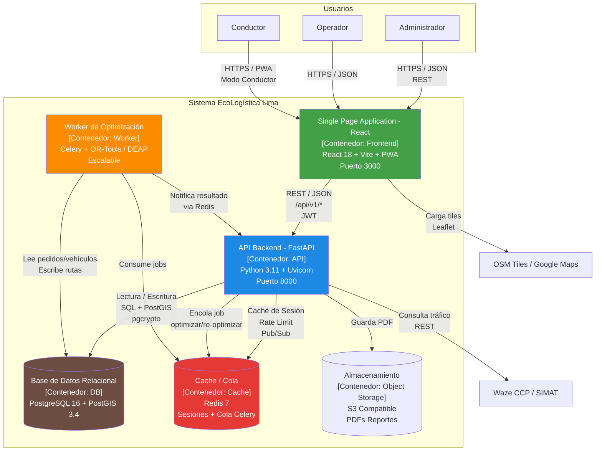
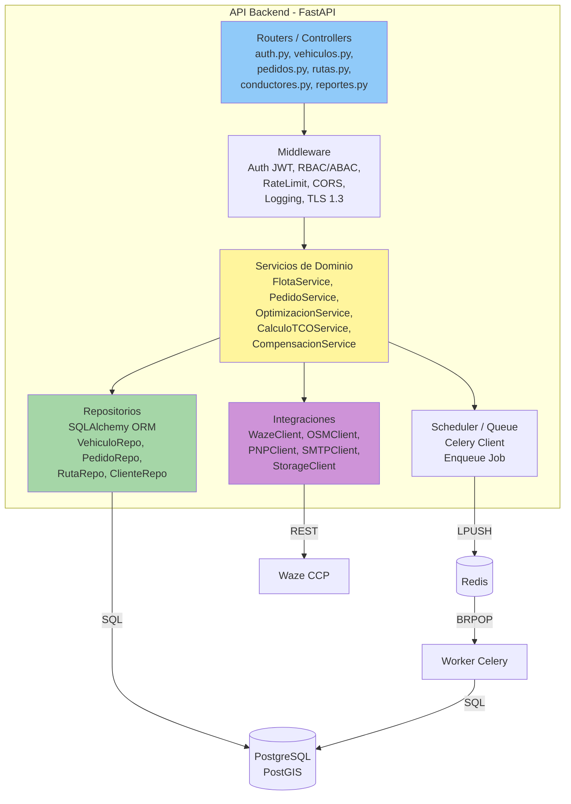

# 12. Arquitectura de Software - Modelo C4 - EcoLogística Lima

**Proyecto:** EcoLogística Lima - Optimizador de Rutas Sostenibles para DistriRápido S.A.C.
**Versión:** V_1_0_0
**Fecha:** 04 de septiembre de 2026
**Stack Seleccionado:** Python FastAPI + React + PostgreSQL/PostGIS + Redis + Leaflet/OpenStreetMap
**Estilo:** arc42 / C4 Model (Simon Brown)

---

## 1. Introducción

La arquitectura sigue el modelo C4 en tres niveles (Contexto, Contenedores, Componentes) más un nivel de despliegue, con decisiones alineadas a RNF-001 (≤45s optimización), RNF-003 (99.5% disponibilidad 05:00-22:00), RNF-002 (OWASP) y RES-06 (open source, 2G/3G).

---

## 2. Nivel 1: Diagrama de Contexto

Muestra el sistema EcoLogística Lima como caja negra, sus usuarios y sistemas externos.

```mermaid
graph TD
    UserAdmin["Administrador<br/>(Sede SJL)"]
    UserOperador["Operador / Técnico<br/>(Dispatcher)"]
    UserConductor["Conductor<br/>(Móvil - Modo Conductor)"]
    UserAuditor["Auditor Externo<br/>(Solo Lectura)"]
    UserCliente["Cliente Bodega/Mercado<br/>(WhatsApp/SMS)"]

    System["Sistema EcoLogística Lima<br/>Plataforma Web VRPTW + Green VRP<br/>[Software System]"]

    ExtAuth["Servicio Externo OAuth2<br/>(Opcional)"]
    ExtMail["Servicio SMTP Cloud<br/>(SendGrid / SES)"]
    ExtWaze["Waze CCP / SIMAT<br/>Tráfico tiempo real"]
    ExtMaps["Google Maps API<br/>(Fallback) / OSM Tiles"]
    ExtPNP["PNP - Zonas de Riesgo<br/>API Datos Abiertos"]
    ExtIGN["IGN Perú / OpenStreetMap<br/>Datos Geográficos"]

    UserAdmin -->|Gestiona flota, parámetros, reportes<br/>HTTPS| System
    UserOperador -->|Gestiona pedidos, genera/re-optimiza rutas<br/>HTTPS| System
    UserConductor -->|Consulta ruta, reporta incidencias<br/>HTTPS / PWA| System
    UserAuditor -->|Audita logs y reportes<br/>HTTPS| System
    UserCliente -->|Registra preferencias, recibe ETA<br/>WhatsApp API / SMS| System

    System -->|Autentica (si SSO)| ExtAuth
    System -->|Envía notificaciones ETA/alerta| ExtMail
    System -->|Consulta congestión y bloqueos<br/>REST JSON| ExtWaze
    System -->|Geocodifica y renderiza tiles<br/>Leaflet| ExtMaps
    System -->|Consulta zonas inseguras| ExtPNP
    System -->|Carga límites distritales y vías| ExtIGN

    style System fill:#2E7D32,stroke:#1B5E20,color:#fff
```

**Usuarios clave:** Ver Documento 08. Usuarios V_1_0_0. **Sistemas externos:** todos vía HTTPS/TLS 1.3 con timeout y circuit breaker.

---

## 3. Nivel 2: Diagrama de Contenedores

Descompone el sistema en contenedores desplegables.



### Descripción de Contenedores

| Contenedor | Tecnología | Responsabilidad | Escalabilidad |
| :--- | :--- | :--- | :--- |
| **SPA React** | React 18, Vite, PWA, Leaflet | UI responsive 320px-1920px, Modo Conductor simplificado, mapa interactivo con capas (congestión, riesgo, vías), dashboard KPIs, offline-first (IndexedDB cache rutas) | CDN + edge cache, bundle ≤300KB gzipped, LCP ≤2.5s en 3G |
| **API Backend FastAPI** | Python 3.11, FastAPI, Pydantic, SQLAlchemy, JWT, Helmet | CRUD flota/pedidos/conductores/clientes, auth RBAC/ABAC, validación, cálculo TCO/CO₂, generación de PDFs, proxy a Waze/OSM | Stateless, HPA 3-20 pods, RTO ≤60s |
| **Worker Optimización** | Celery, Redis, OR-Tools, DEAP | Ejecuta metaheurística GA/Tabú/ACO desacoplada, respeta RN-003 a RN-017, retorna en ≤45s/≤30s | Escalable independiente (HPA basado en cola >20 jobs) |
| **PostgreSQL + PostGIS** | PG 16 + PostGIS + pgcrypto | Persistencia 3FN, geoespacial GiST, RLS, particionamiento mensual pedidos | Primary + replica lectura, RPO ≤10s, backup PITR |
| **Redis** | Redis 7 | Sesiones JWT, rate-limit (3 intentos/15min), cola Celery, cache de tráfico (TTL 2min) | Sentinel / Cluster |
| **Object Storage** | S3 (MinIO/AWS S3) | PDFs de reportes sostenibilidad, retención 1 año | Versionado |

**Flujo optimización:** WA `POST /rutas/optimizar` → API valida → encola en Redis → Worker consume → calcula → escribe `rutas` + `ruta_pedidos` → notifica vía WebSocket/polling → WA muestra mapa.

---

## 4. Nivel 3: Diagrama de Componentes (API Backend)

Estructuración interna del contenedor API FastAPI.



### Componentes Detallados

| Componente | Responsabilidad | Patrones |
| :--- | :--- | :--- |
| **Routers** | Expone `REST /api/v1/*` con validación Pydantic, OpenAPI 3.0 auto, paginación, filtrado por distrito | Controller, DTO |
| **Middleware Seguridad** | Valida JWT (30min), RBAC (matriz Documento 08), ABAC (jornada, MTC, horario), rate-limit 3/15min (RN-001), sanitiza inputs, audita | Chain of Responsibility |
| **FlotaService / PedidoService** | Lógica de negocio atómica (RN-002 a RN-024), validación de capacidad, bounding box Lima, conversión GNV ROI | Service Layer, Domain Model |
| **OptimizacionService** | Prepara payload para Worker: valida factibilidad (capacidad, ventanas, MTC, descanso), construye matriz de distancias (PostGIS `ST_Distance`), encola | Facade |
| **CalculoTCOService / CompensacionService** | `CO₂ = dist * factor` (RN-002), `TCO` (RN-009), `árboles = CO₂/22` (RN-018), usa parámetros versionados | Strategy, Calculator |
| **Repositorios** | Abstrae acceso a datos con SQLAlchemy, queries optimizadas con índices GIST, `EXPLAIN ANALYZE` ≤200ms | Repository, Unit of Work |
| **Integraciones** | Clients con retry + circuit breaker (Resilience: tenacity), cache Redis TTL 2min para tráfico, fallback a datos locales si Waze no responde | Adapter, Circuit Breaker |
| **Scheduler** | Encola jobs `optimizar` y `re-optimizar` con prioridad (express primero), monitoreo Prometheus `queue_depth` | Producer |

**Seguridad:** Todo request pasa por Middleware antes de Services. Logs anonimizados, payload_hash SHA256.

---

## 5. Nivel 4 (Opcional - Código) y Despliegue

### Diagrama de Despliegue (Kubernetes)

```mermaid
graph TD
    UserMobile[Dispositivo Móvil<br/>Chrome 90+ / PWA]
    CDN[CDN / Nginx<br/>TLS 1.3]
    K8s[K8s Cluster<br/>sa-east-1 (Renovable)]
    K8s --> PodWA[Pod React<br/>3 replicas]
    K8s --> PodAPI[Pod FastAPI<br/>HPA 3-20]
    K8s --> PodWorker[Pod Celery Worker<br/>HPA 2-10]
    K8s --> PodRedis[Redis Sentinel]
    K8s --> PodDB[(PostgreSQL Primary<br/>+ Replica)]
    K8s --> Storage[S3 Bucket]

    UserMobile -->|HTTPS| CDN --> PodWA
    PodWA --> PodAPI
    PodAPI --> PodDB
    PodAPI --> PodRedis
    PodRedis --> PodWorker
```

**Recursos por pod:** API 500m CPU/512Mi, Worker 1000m/1Gi (cómputo), DB 2000m/4Gi. Autoscaling por CPU >70% y `celery_queue >20`.

**Observabilidad:** Prometheus + Grafana (RNF-001 latency, RNF-003 uptime), SonarQube (RNF-007), Axe/Lighthouse CI (RNF-005), ZAP (RNF-002).

---

## 6. Decisiones Arquitectónicas (ADR Resumen)

| ADR | Decisión | Justificación | Alternativa descartada |
| :--- | :--- | :--- | :--- |
| ADR-01 | FastAPI + React (Alt.2) | Ver Documento 10 | MERN (sin OR-Tools), Spring (costo JVM) |
| ADR-02 | PostgreSQL + PostGIS | Geoespacial OGC, RLS, costo | MongoDB (Geo limitado) |
| ADR-03 | Worker desacoplado (Celery+Redis) | No bloquear API en cómputo 45s, cumplir RNF-001 | Cómputo en request (bloqueante) |
| ADR-04 | Leaflet/OSM primario | Costo 0, open source, tiles cacheables | Google Maps solo (costo USD) |
| ADR-05 | PWA offline-first | Cortes SJL y 2G/3G (RNF-003/006) | Solo online |

---

*Fin del Documento 12. Modelo C4 V_1_0_0*
